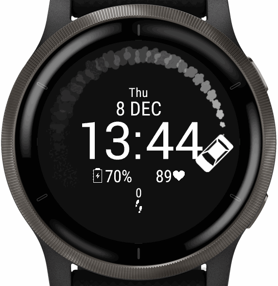

# CarDrift Garmin Watch Face

Animated GIF (that loops) for Garmin watches, packaged in a watchface.

To install, just move the PRG file into GARMIN/APPS when plugging your watch into your computer.
(see darmin docs on how to generate the prg file, in vscode its `F1 -> Monkey C: Build for Device`)

---

Garmin Documentation used: https://developer.garmin.com/connect-iq/api-docs/index.html

Setup:
- Download SDK https://developer.garmin.com/connect-iq/sdk/ (and maybe create an account)
- and follow the rest of the guide in the docs

Only for Venu 2 products right now.

Original code pulled from https://github.com/rxkt/aqua_cat_watchface

Monkey Motion is required to convert mp4/gif file formats for Garmin.

---

Once everything is installed VsCode should be able to run it on your computer with F5 (while focused on a .mc file)
