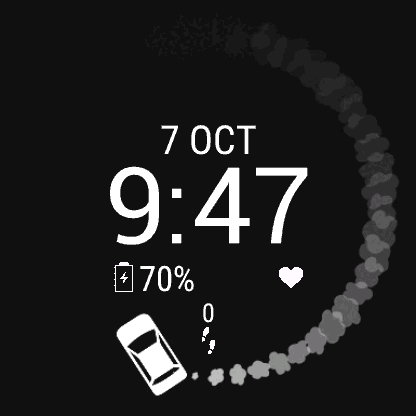

# CarDrift Garmin Watch Face

Animated GIF (that loops) for Garmin watches, packaged in a watchface.  

<!--TODO create a gif with the watch in it-->

To install, just move the generated PRG file into GARMIN/GARMIN/APPS when plugging your watch into your computer.  
(see docs on how to generate the prg file)

---

Garmin Documentation used:  
https://developer.garmin.com/connect-iq/api-docs/index.html  
API version 4.1.x, only for Venu 2 products right now.  

Original code pulled from https://github.com/rxkt/aqua_cat_watchface

Monkey Motion is required to convert mp4/gif file formats for Garmin.
